# คู่มือใช้งานระบบจัดการเว็บไซต์ SK Sport (สำหรับลูกค้า)

> ระบบนี้ออกแบบให้ **จัดตามหน้าเว็บ** — อยากแก้อะไร ให้นึกว่า "สิ่งนั้นอยู่หน้าไหนของเว็บ"
> แล้วเข้าเมนูชื่อเดียวกัน ภายในแต่ละหน้า การ์ดจะเรียง **บน→ล่าง ตรงตามที่เห็นบนเว็บจริง**

---

## 1) เข้าสู่ระบบ

1. เปิดเว็บไซต์แล้วต่อท้ายด้วย `/admin` เช่น `https://www.sksporttrading.com/admin`
2. กรอก **รหัสผ่าน** (ช่องเดียว ไม่มีชื่อผู้ใช้) แล้วกด "เข้าสู่ระบบ"
3. ระบบจะจำการเข้าสู่ระบบไว้ 24 ชั่วโมง

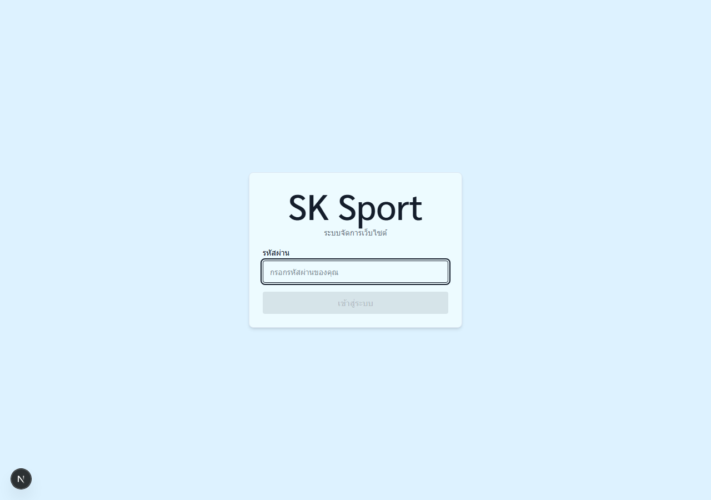

> ⏱ **สำคัญ:** ทุกครั้งที่กด "บันทึก" เว็บไซต์จริงจะอัปเดตภายใน **2-3 นาที**
> (ระบบจะขึ้นข้อความ "✅ บันทึกแล้ว" ให้เห็นชัดเจน)

## 2) วิธีใช้งานพื้นฐาน — เหมือนกันทุกหน้า

- แต่ละหน้า = รายการ **การ์ด** เรียงตามตำแหน่งบนเว็บจริง การ์ดมีหมายเลขกำกับ (1, 2, 3, …)
- ใต้ชื่อทุกช่องมี**คำอธิบายสีเทา**บอกว่าข้อความ/รูปนั้นแสดงตรงไหนบนเว็บ
- แก้เสร็จกดปุ่ม **"บันทึก"** ของการ์ดนั้น — การ์ดอื่นไม่เกี่ยวกัน
- **รูปภาพ:** เห็นรูปปัจจุบันเสมอ กด "เปลี่ยนรูป" หรือ "+ เพิ่มรูป" เลือกจากเครื่องได้เลย
  ระบบย่อขนาดรูปและตั้งชื่อไฟล์ให้อัตโนมัติ (เลือกหลายรูปพร้อมกันได้)
- ปุ่ม **"ดูหน้าเว็บจริง ↗"** มุมขวาบน เปิดหน้านั้นของเว็บในแท็บใหม่ ไว้เทียบก่อน-หลังแก้
- ใช้บนมือถือได้ — เมนูอยู่ในปุ่ม ☰ มุมซ้ายบน

---

## 3) เมนูแต่ละหน้า

### 🏠 หน้าแรก

การ์ดเรียงตามหน้าแรกของเว็บ บน→ล่าง:

| #   | การ์ด                  | แก้อะไรได้                                                  |
| --- | ---------------------- | ----------------------------------------------------------- |
| 1   | รูปแบนเนอร์ใหญ่ (Hero) | รูปสไลด์ เพิ่ม/ลบ/สลับลำดับ                                 |
| 2   | ข้อความบนแบนเนอร์      | หัวข้อ 3 ท่อน ("ก้าว/ข้าม/ขีดจำกัด"), คำอธิบาย, ข้อความปุ่ม |
| 3   | โลโก้พาร์ทเนอร์        | โลโก้ เพิ่ม/ลบ/สลับลำดับ                                    |
| 4   | ส่วนบริการ             | ดูอย่างเดียว — มีปุ่มลัดไปแก้ที่หน้า "บริการ"               |
| 5   | สินค้าของเรา           | หัวข้อ section                                              |
| 6   | ผลงาน                  | ข้อความปุ่ม "ดูทั้งหมด"                                     |
| 7   | เกี่ยวกับบริษัท        | ชื่อบริษัท + รายละเอียด                                     |
| 8   | ส่วนติดต่อ + แผนที่    | ข้อความ 2 บรรทัด (แผนที่แก้ที่หน้า "ติดต่อเรา")             |
| 9   | แกลเลอรีรูปภาพ         | รูป เพิ่ม/ลบ/สลับลำดับ                                      |
| 10  | 🔠 ขนาดตัวอักษร        | ขนาดตัวหนังสือ 7 จุดของหน้าแรก (กดหัวการ์ดเพื่อกางออก)      |

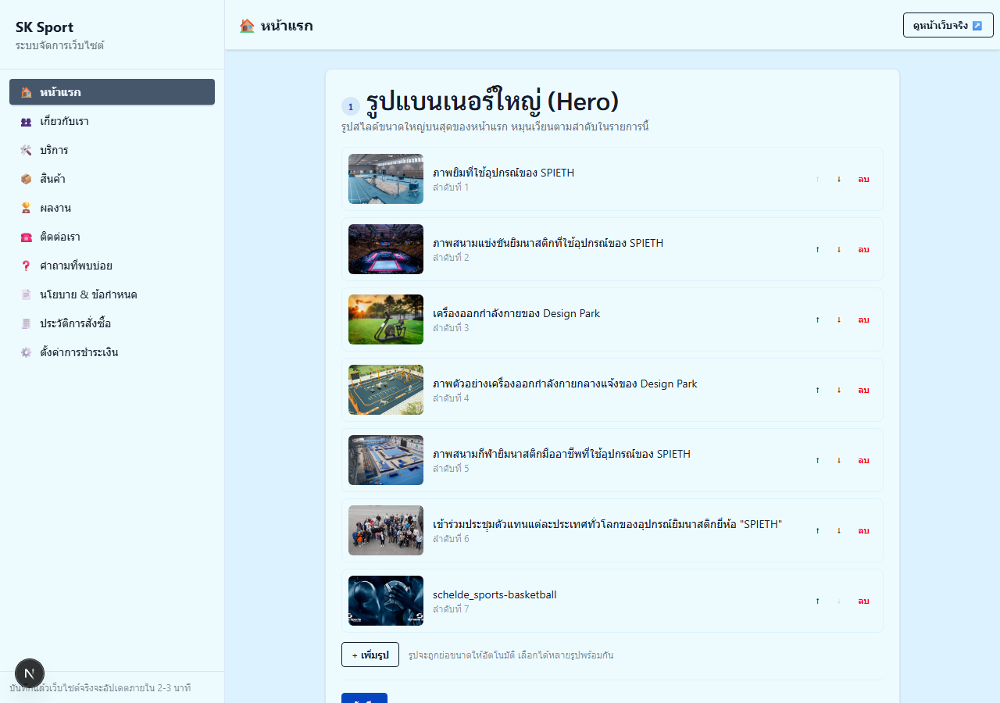

### 👥 เกี่ยวกับเรา

1. รูป + ข้อความแบนเนอร์ → 2. ประวัติบริษัท (พร้อมกล่องสถิติ เช่น ปีที่ก่อตั้ง) →
2. พันธกิจ/วิสัยทัศน์ → 4. วิดีโอ YouTube (วางลิงก์ได้เลย) → 5. **ทีมงาน** →
3. ขนาดตัวอักษร

**วิธีแก้ข้อมูลทีมงาน (ใช้บ่อยสุด):** กดชื่อสมาชิก → ฟอร์มจะกางออก แก้ชื่อ ตำแหน่ง
คำแนะนำสั้น ประวัติเต็ม คำคม **รูปการ์ด** และแกลเลอรีได้ครบ → กด "บันทึก" ท้ายการ์ด
เพิ่มคนใหม่ด้วยปุ่ม "+ เพิ่มสมาชิกใหม่" สลับลำดับด้วยปุ่ม ↑ ↓

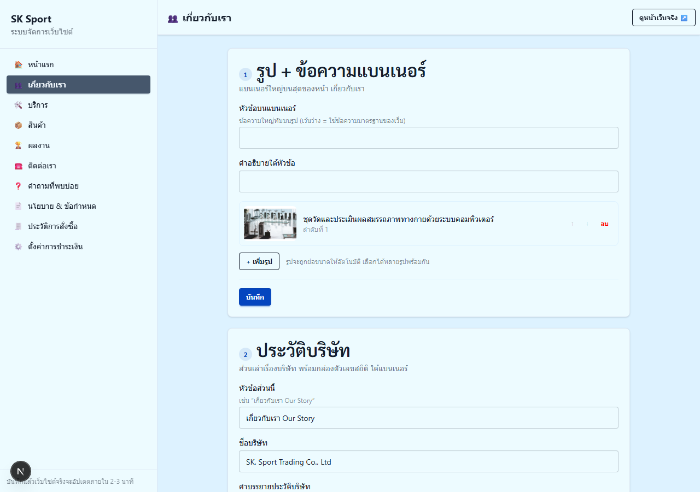

### 🛠 บริการ

1. แบนเนอร์หน้ารวม → 2. **รายการบริการ** (กดชื่อเพื่อแก้รายตัว: ชื่อ, ชื่อรอง, รูปแบนเนอร์,
   เนื้อหาเป็นหัวข้อๆ เลือกได้ว่า "แบบแถว" รูปคู่ข้อความ หรือ "แบบตาราง" หลายรูป) →
2. ขนาดตัวอักษร

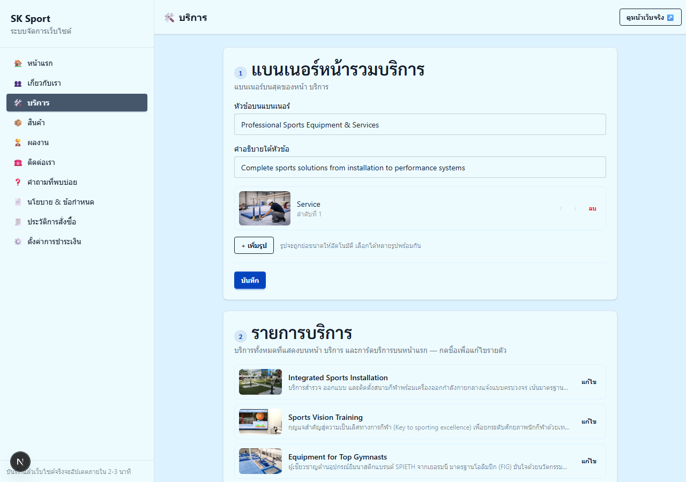

### 📦 สินค้า

1. แบนเนอร์ → 2. **รายการสินค้า** — ปุ่ม "+ เพิ่มสินค้าใหม่" อยู่บนสุด
   กดชื่อสินค้าเพื่อแก้: ชื่อ, ชื่อรอง, หมวด, รูปแบบขาย (ขอใบเสนอราคา / ซื้อเลย+ราคา),
   คำอธิบาย, รูป → 3. ขนาดตัวอักษร

> ที่อยู่ลิงก์ของหน้าสินค้า **สร้างให้อัตโนมัติ** จากชื่อ — ไม่ต้องตั้งเอง

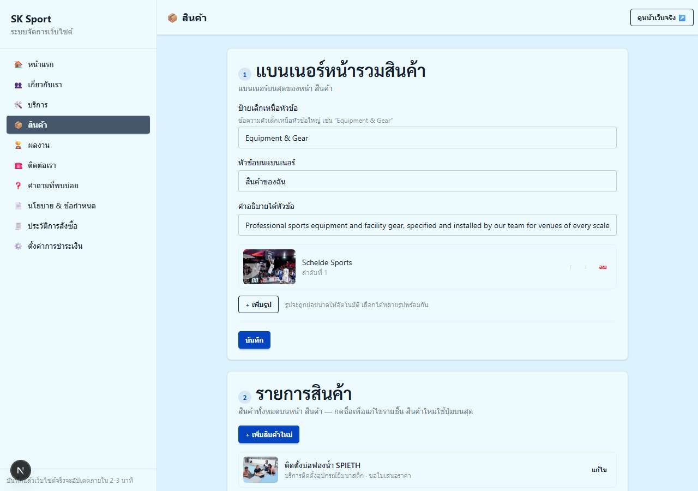

### 🏆 ผลงาน

1. แบนเนอร์ → 2. **รายการบทความผลงาน** — ปุ่ม "+ เพิ่มบทความใหม่" อยู่บนสุด
   กดชื่อเพื่อแก้: ชื่อ, แท็ก, ติ๊ก "เป็นผลงานเด่น" ได้, เนื้อหา, รูปหลัก, แกลเลอรี →
2. ขนาดตัวอักษร

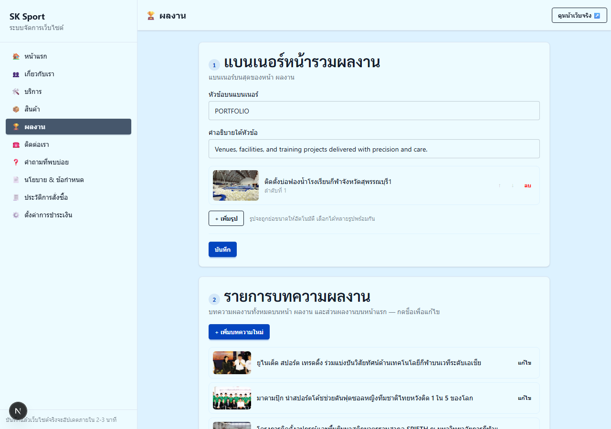

### ☎️ ติดต่อเรา

1. แบนเนอร์ + ข้อความ → 2. **แผนที่ Google Map** → 3. **ข้อมูลติดต่อ**
   (เบอร์, อีเมล, ที่อยู่, ลิงก์ Facebook/YouTube/LINE — แสดงท้ายเว็บทุกหน้า) →
2. ขนาดตัวอักษร

**วิธีเปลี่ยนแผนที่:** เปิด Google Maps → ค้นหาที่อยู่ → กด "แชร์" → แท็บ "ฝังแผนที่" →
"คัดลอก HTML" → วางทั้งหมดลงในช่อง (ระบบดึงเฉพาะลิงก์ให้เอง และโชว์ตัวอย่างแผนที่ทันที)

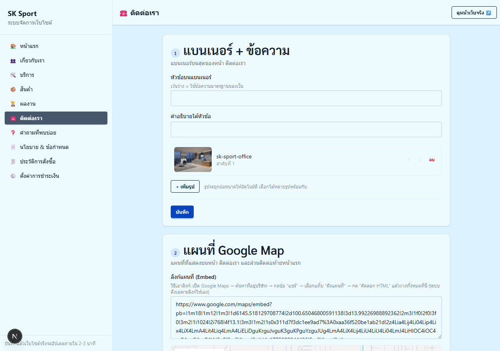

### ❓ คำถามที่พบบ่อย

1. ข้อความหัวหน้า → 2. รายการคำถาม-คำตอบ (เพิ่ม/ลบ/สลับลำดับ) →
2. กล่องชวนติดต่อท้ายหน้า → 4. ขนาดตัวอักษร

> คำถามชุดนี้ใช้กับ**ตัวช่วยตอบคำถามมุมขวาล่างของเว็บ**ด้วย แก้ที่เดียวอัปเดตทั้งคู่

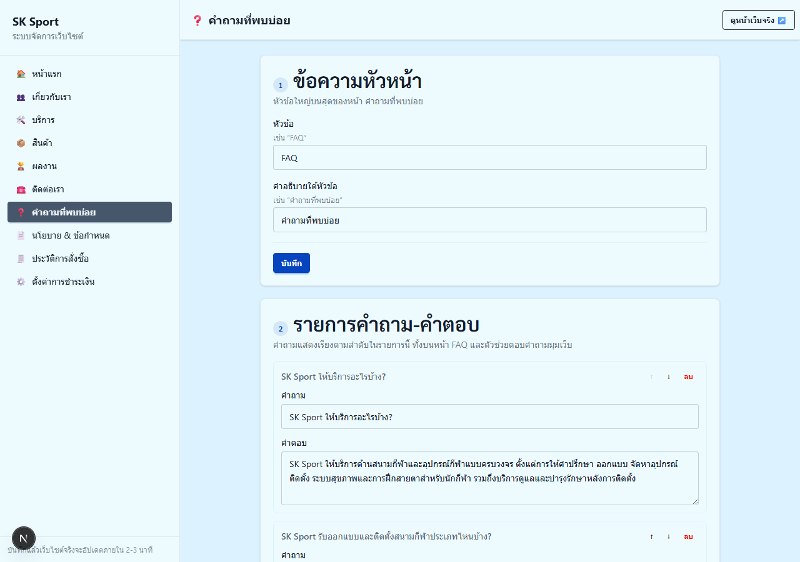

### 📄 นโยบาย & ข้อกำหนด

เลือกแท็บ "นโยบายความเป็นส่วนตัว" หรือ "ข้อกำหนดการใช้งาน" → แก้หัวข้อ, วันที่อัปเดต,
และเนื้อหาเป็น**ข้อความธรรมดา** — พิมพ์เป็นย่อหน้า เว้นบรรทัดว่างระหว่างย่อหน้า
ระบบจัดรูปแบบให้เว็บเอง

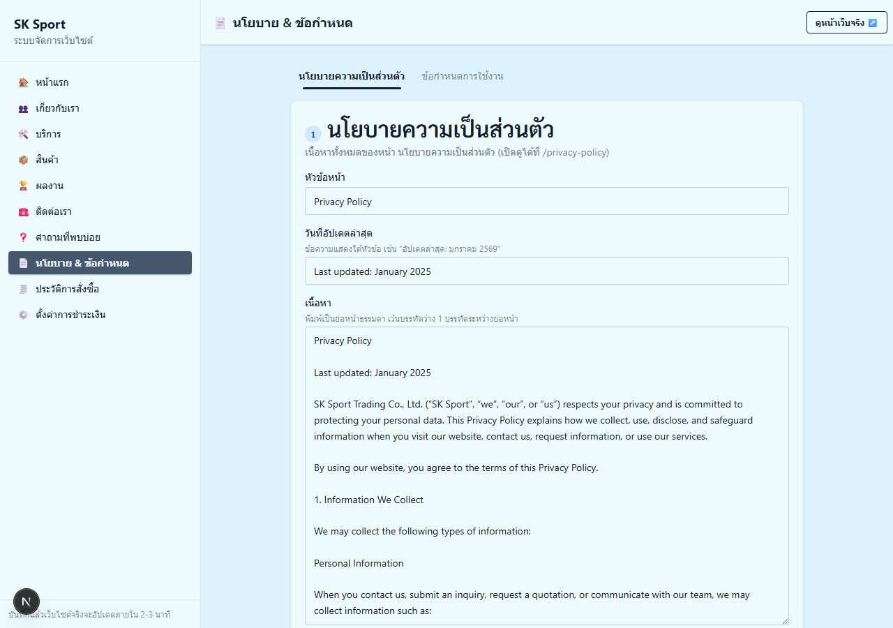

### 🧾 ประวัติการสั่งซื้อ (ดูอย่างเดียว)

ตารางรวม **คำสั่งซื้อ** (ลูกค้ากดซื้อ+แนบสลิป) และ **คำขอใบเสนอราคา** ทั้งเก่าและใหม่
เรียงล่าสุดขึ้นก่อน — กดแถวเพื่อดูรายละเอียดสินค้า ที่อยู่จัดส่ง และ**รูปสลิปโอนเงิน**
(กดที่รูปเพื่อเปิดเต็มจอ)

ทุกออเดอร์ใหม่จะมี**อีเมลแจ้ง**ส่งไปที่อีเมลที่ตั้งไว้ในหน้า "ตั้งค่าการชำระเงิน" ด้วย

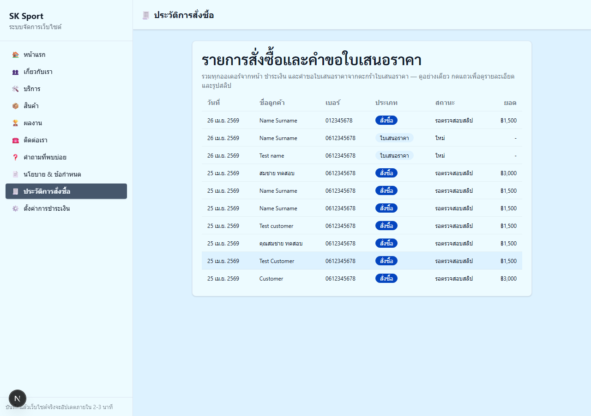

### ⚙️ ตั้งค่าการชำระเงิน

เปิด/ปิดการรับโอนเงิน, อีเมลรับแจ้งออเดอร์, ธนาคาร, ชื่อ/เลขบัญชี, สาขา,
คำแนะนำการโอน และรูป QR Code รับเงิน

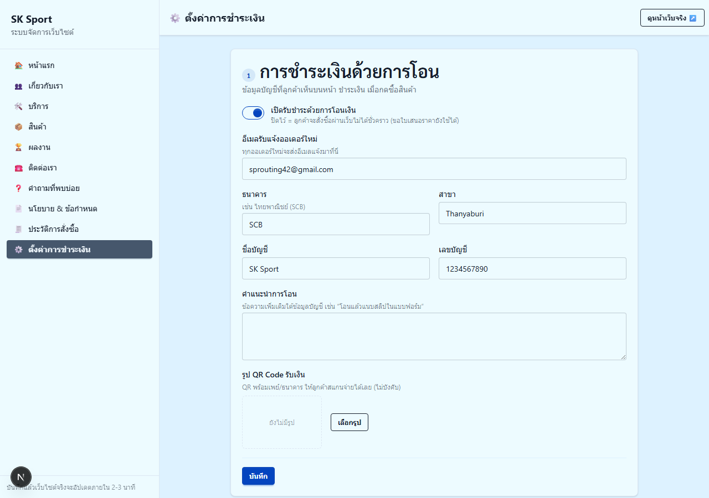

---

## 4) คำถามที่พบบ่อยเกี่ยวกับระบบ

**กดบันทึกแล้วเว็บยังไม่เปลี่ยน?**
รอ 2-3 นาทีแล้วรีเฟรชหน้าเว็บ (กด Ctrl+F5 / ลากหน้าจอลงบนมือถือ) — ระบบกำลังสร้างหน้าเว็บใหม่

**ขึ้น "กรุณาเข้าสู่ระบบใหม่อีกครั้ง"?**
การเข้าสู่ระบบหมดอายุ (24 ชม.) — กลับไปที่ `/admin` แล้วกรอกรหัสผ่านใหม่

**บันทึกไม่สำเร็จ (ขึ้น ❌)?**
ตรวจอินเทอร์เน็ตแล้วกด "บันทึก" ซ้ำ ถ้ายังไม่ได้ให้ปิด-เปิดหน้านั้นใหม่แล้วแก้อีกครั้ง

**อัปโหลดรูปไม่ขึ้น?**
ใช้ไฟล์รูปทั่วไป (JPG, PNG, WebP) — ระบบย่อรูปใหญ่ให้เอง ถ้ารูปใหญ่มาก (เกิน ~20MB)
ให้ย่อก่อนหรือถ่ายใหม่

**ลบอะไรผิดไป กู้คืนได้ไหม?**
ได้ — ทุกการบันทึกถูกเก็บประวัติไว้ครบ ติดต่อผู้ดูแลระบบเพื่อย้อนกลับเวอร์ชันก่อนหน้า

---

## 5) สำหรับผู้ดูแลระบบ (ทีมเทคนิค)

- โค้ด admin: `src/app/admin/` + `src/admin/` • API: `functions/api/` (Cloudflare Pages Functions)
- Env ที่ต้องตั้งใน Cloudflare Pages: `ADMIN_PASSWORD`, `GITHUB_TOKEN` (fine-grained,
  contents:write เฉพาะ repo นี้), `GITHUB_REPO`, `GITHUB_BRANCH` และ (ถ้าต้องการอีเมล)
  `RESEND_API_KEY`, `EMAIL_FROM`, `EMAIL_FROM_NAME` (+ `ADMIN_SESSION_SECRET` แนะนำ)
- ทุกการบันทึกจาก admin = 1 git commit ข้อความภาษาไทย → ใช้ `git log` เป็น audit log
  และ `git revert` เพื่อย้อนการแก้ไขได้
- ทดสอบบนเครื่อง: `npm run dev` + `npm run admin:dev` (รหัสผ่าน dev: `sksport-dev`)
  — การแก้ไขจะเขียนลง working tree ตรวจด้วย `git diff` ก่อน commit
- อัปเดต screenshot ในคู่มือนี้: `node scripts/admin-screenshots.mjs`
